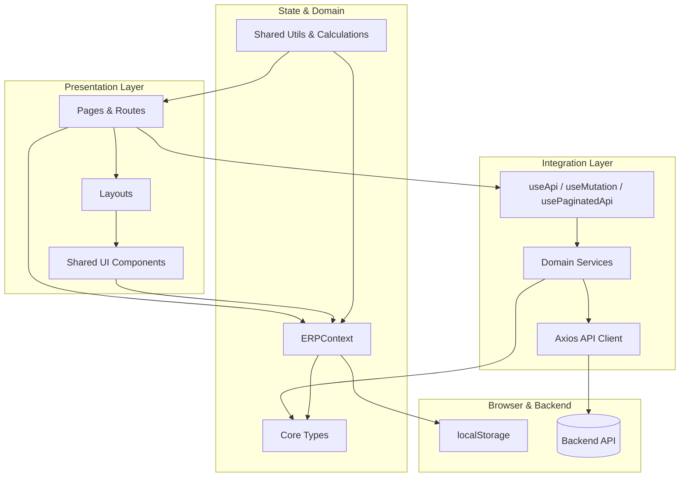

# Cafe ERP Dashboard – Architecture & Best Practices

> Analysis of the current frontend architecture, identified issues, recommended structure, migration guidance, and production-readiness checklist.

## Table of Contents

- [Architecture Overview](#architecture-overview)
- [Current Project Structure](#current-project-structure)
- [Architectural Pattern](#architectural-pattern)
- [Identified Issues & Risks](#identified-issues--risks)
- [Recommended Folder & Module Structure](#recommended-folder--module-structure)
- [Refactoring & Migration Guide](#refactoring--migration-guide)
- [Best Practices](#best-practices)
  - [Coding & Naming Conventions](#coding--naming-conventions)
  - [Dependency Management & Configuration](#dependency-management--configuration)
  - [Security Improvements](#security-improvements)
  - [Logging & Error Handling](#logging--error-handling)
- [Production Optimization Checklist](#production-optimization-checklist)
  - [Performance & Scalability](#performance--scalability)
  - [Caching & Rate Limiting](#caching--rate-limiting)
  - [CI/CD & Dockerization](#cicd--dockerization)
  - [Monitoring & Observability](#monitoring--observability)
  - [API Documentation](#api-documentation)

---

## Architecture Overview

At a high level, the application is a **monolithic React SPA** with a clean separation between:

- **Presentation layer**
  - `src/pages` – route-level views (Dashboard, DailyRecord, DailyExpense, ProductCosts, FixedCosts, FundManagement, Reports).
  - `src/layouts` – shared layout wrappers (e.g., `DashboardLayout`).
  - `src/shared/components` – reusable UI widgets (buttons, cards, tables, modals, error boundary, charts, layout pieces).

- **State & Domain layer**
  - `src/context` – `ERPContext` for transactions, filters, statistics, and derived daily records.
  - `src/core/types` – shared TypeScript domain models for transactions, payments, stats, and common types.
  - `src/shared/utils` – domain-specific helpers: calculations, validation, export, error handling, constants, static auth.

- **Integration layer**
  - `src/services` – HTTP client (`api.ts`) and typed service modules for auth, sales, expenses, funds, and reports.
  - `src/hooks` – reusable hooks for API access, mutations, pagination, and auth.

This is a **layered architecture with feature-focused folders**, suitable for a medium-sized SPA that may grow into a richer ERP frontend.

### Architecture Diagram



---

## Current Project Structure

Key directories (simplified):

- `src/App.tsx` – main router, ErrorBoundary, ToastProvider, protected dashboard route.
- `src/main.tsx` – Vite/React entry point.
- `src/layouts/DashboardLayout.tsx` – header + sidebar + nested routes.
- `src/pages/` – page components for each functional area.
- `src/features/auth/Login.tsx` – dedicated login page with static password + guest mode.
- `src/context/ERPContext.tsx` – ERP domain state and derived stats.
- `src/core/types/` – `transaction.types.ts`, `payment.types.ts`, `common.types.ts`, `ERPContextType`.
- `src/services/api.ts` – Axios instance and generic API wrapper.
- `src/services/modules/` – auth, sales, expenses, fund, reports services.
- `src/hooks/` – `useApi`, `useMutation`, `usePaginatedApi`, `usePagination`, `useAuth`.
- `src/shared/components/` – UI components, layout parts, ErrorBoundary.
- `src/shared/utils/` – constants, calculations, validation, static auth, error handler, export helpers.

The existing `docs/ARCHITECTURE.md` and `docs/OVERVIEW.md` already provide a concise summary; this document deepens that with guidance and best practices.

---

## Architectural Pattern

The codebase follows a **hybrid Layered + Modular (feature-oriented) architecture**:

- **Layered**: Clear separation between UI, domain state (context + types), and integration (services/hooks).
- **Modular**: Features like auth, sales, expenses, funds, and reports are grouped in their own services and (partially) pages.

Strengths:

- Shared types in `src/core/types` keep domain models consistent.
- `ERPContext` centralizes ERP-specific business logic and derived stats.
- Services in `src/services/modules` encapsulate API endpoints behind typed functions.
- Hooks (`useApi`, `useMutation`, `usePaginatedApi`) promote reuse and consistent async patterns.
- ErrorBoundary and error handler utilities support a robust error strategy.

Areas to refine:

- Auth is split between **static/local auth** (`staticPassword.ts`) and **API-based auth** (`auth.service.ts` + `useAuth`); currently the router uses the static path.
- Error handling is partly centralized but not yet applied uniformly across all async flows.
- Export/report endpoints use a generic `api` wrapper that doesn’t yet expose all Axios config options (e.g., `responseType: 'blob'`).

---

## Identified Issues & Risks

Below are the main issues observed while reviewing the codebase.

1. **Dual Authentication Approaches**
   - `LoginPage` and `App.tsx` use static/local auth (`staticPassword.ts`, `isAuthenticated()` from shared utils).
   - `authService` and `useAuth` are implemented for real token-based auth, but not wired into the main flow.
   - **Risk**: Confusion over the source of truth for auth; harder to migrate to production-grade auth if not unified.

2. **Export/Blob Handling via Generic API Wrapper**
   - `reportsService.exportReport` calls `api.get('/reports/export', { ...params, responseType: 'blob' })`.
   - The generic `api.get<T>(url, params)` signature only forwards params, not full Axios config; `responseType` might be incorrectly treated as a query param rather than Axios config.
   - **Risk**: File exports may not work correctly or types may be misleading.

3. **Partial Adoption of Centralized Error Handling**
   - ErrorBoundary is in place and the guide in `ERROR_HANDLING_GUIDE.md` is strong.
   - Some key flows (e.g., Dashboard sale form) use `handleError`, but not all async operations across pages are wrapped.
   - `useApi` and `useMutation` manage their own error state instead of plugging into `handleError` or a common error pipeline.
   - **Risk**: Inconsistent UX for errors; some failures may show console errors but no user feedback or logging.

4. **Local-Only Authentication & Security**
   - Static passwords and local `authToken` are clearly marked as **not secure** and for demo/offline usage only.
   - **Risk**: If deployed as-is for production, anyone with frontend access can discover static credentials; token can be forged in localStorage.

5. **Tight Coupling of ERPContext to localStorage**
   - `ERPContext` both computes domain state and directly reads/writes `localStorage`.
   - **Risk**: Harder to reuse domain logic with a future backend or abstract persistence layer.

6. **Limited Test Infrastructure (Code Level)**
   - There is rich **testing documentation** for ErrorBoundary, but no automated tests in the repo yet (unit/integration/E2E).
   - **Risk**: Refactors and new features may break existing behavior without quick feedback.

---

## Recommended Folder & Module Structure

The current structure is solid; the following adjustments make it more scalable and explicit.

### Proposed High-Level Structure

```text
src/
  app/
    App.tsx
    routes.tsx
    providers.tsx   # ERPProvider, ToastProvider, RouterProvider wiring
  features/
    auth/
      LoginPage.tsx
      useAuth.ts      # wraps authService + static/real auth switching
    dashboard/
      DashboardPage.tsx
      components/
    daily-record/
      DailyRecordPage.tsx
    expenses/
      DailyExpensePage.tsx
      ProductCostsPage.tsx
      FixedCostsPage.tsx
    funds/
      FundManagementPage.tsx
    reports/
      ReportsPage.tsx
  entities/
    transactions/
      model.ts        # Transaction types + helpers
      context.tsx     # ERPContext (or use Zustand/Redux later)
      calculations.ts
    settings/
      ...
  shared/
    components/
      ui/
      layout/
    hooks/
      useApi.ts
      useMutation.ts
      usePaginatedApi.ts
      usePagination.ts
    utils/
      errorHandler.ts
      validation.ts
      export.ts
      constants.ts
      staticPassword.ts
    types/
      index.ts
  services/
    api.ts
    modules/
      auth.service.ts
      sales.service.ts
      expenses.service.ts
      fund.service.ts
      reports.service.ts
```

Key ideas:

- Introduce an `app/` area for cross-cutting wiring (providers, router config) to avoid overloading `App.tsx`.
- Keep **features** (auth, dashboard, expenses, funds, reports) together, so each feature has its own page + feature-specific components.
- Move core domain models into `entities/transactions` or keep them in `core/types` but treat them as the canonical domain layer.
- Dedicate a `shared/hooks` and `shared/utils` namespace for hooks and utilities used across features.

---

## Refactoring & Migration Guide

The following steps outline an incremental migration path from the current structure to a more scalable and maintainable one, without breaking existing functionality.

### Step 1 – Centralize App Providers & Routing

1. Create `src/app/providers.tsx` that composes:
   - `ErrorBoundary`
   - `ToastProvider`
   - `ERPProvider`
   - `BrowserRouter` / `Routes`
2. Keep `App.tsx` as a thin shell that imports and uses `AppProviders` from `providers.tsx`.
3. Optionally extract routes to `src/app/routes.tsx` to keep routing declarative and testable.

**Benefit**: De-clutters `App.tsx` and makes it easier to adjust providers or routing in one place.

### Step 2 – Unify Authentication

1. Introduce a single `AuthContext` or reuse `useAuth` as the **source of truth** for auth state.
2. Decide on environments:
   - **Demo/Offline**: Use `staticPassword.ts`, but wrap it behind `authService`-like functions.
   - **Production**: Use real backend auth via `auth.service.ts`.
3. Update `LoginPage` to call `useAuth().login` instead of `loginAsOwner/loginAsGuest` directly.
4. Update `RequireAuth` in `App.tsx` to rely on `useAuth().isAuthenticated` rather than `isAuthenticated()` from static utils.
5. Keep `staticPassword.ts` as an implementation detail (for demo mode) behind the `authService` abstraction.

**Benefit**: One consistent path for auth logic, easier migration from local-only to real backend authentication.

### Step 3 – Decouple ERPContext from Storage

1. Extract persistence into separate helper functions or a `repository` module, e.g., `erpStateRepository.ts`:
   - `loadERPState(kind: 'demo' | 'real'): ERPState`
   - `saveERPState(kind, state)`
2. Update `ERPContext` to depend on this repository instead of directly accessing `localStorage`.
3. Add simple interfaces to allow future replacement (e.g., remote persistence or hybrid local+remote sync).

**Benefit**: Easier to unit-test `ERPContext` and later migrate to server-side persistence while maintaining the same UI.

### Step 4 – Standardize Error Handling Through Hooks

1. Extend `useApi` and `useMutation` to optionally accept an `onError` callback that calls `handleError` with context.
2. Replace ad-hoc `try/catch` + toast logic in pages with calls to these hooks, passing action metadata into `handleError`.

Example:

```ts
const { data, loading, error } = useApi(() => salesService.getAll(), []);

useEffect(() => {
  if (error) {
    handleError(error, { action: 'fetch_sales', severity: 'high' });
  }
}, [error]);
```

or provide direct integration inside the hook.

**Benefit**: Consistent UX on failures and a single place to enhance logging/telemetry.

### Step 5 – Harden Export & Binary API Calls

1. Extend `api.get` (and other methods) to accept a full Axios config object, or add a dedicated `api.request` helper for advanced use cases.
2. Update `reportsService.exportReport` to use `responseType: 'blob'` correctly, e.g.:

```ts
export const exportReport = async (params: ExportParams): Promise<Blob> => {
  const response = await apiClient.get<Blob>('/reports/export', {
    params,
    responseType: 'blob',
  });
  return response;
};
```

**Benefit**: Reliable export functionality with accurate typings and behavior.

### Step 6 – Introduce Automated Tests Gradually

1. Add **unit tests** for:
   - `ERPContext` calculations (stats, daily records) using in-memory test data.
   - Validation schemas (`validation.ts`).
   - Utility functions (formatters, calculations, date range filters).
2. Add **component-level tests** (React Testing Library) for:
   - Login page flow (happy path + failure).
   - Dashboard Quick Sale form.
   - ErrorBoundary behavior.
3. Add **E2E tests** (Playwright or Cypress) for:
   - Login + navigation.
   - Core dashboard flows.
   - Simple report flow.

**Benefit**: Safer refactoring and confidence when evolving the architecture.

---

## Best Practices

### Coding & Naming Conventions

- **Files & Components**
  - Use `PascalCase` for React components (e.g., `DashboardLayout`, `FundManagementPage`).
  - Use `camelCase` for hooks and helpers (`useApi`, `handleError`, `generateId`).
  - Prefer one React component per file for clarity and easier testing.

- **Types & Interfaces**
  - Keep domain types centralized in `core/types` (or `entities/`), and re-export them through a barrel file for convenience.
  - Use descriptive names like `FundOperationData`, `SalesStats`, `DailyRecord` instead of bare `Data` or `Info`.

- **Enums & Constants**
  - Use literal unions in types and constant objects (`TRANSACTION_TYPES`, `PAYMENT_METHODS`) for consistency and type safety.

### Dependency Management & Configuration

- Pin main dependencies via `package-lock.json` and upgrade intentionally.
- Use `npm ci` in CI for deterministic installs.
- Keep environment-specific settings in `.env` and document them (currently only `VITE_API_URL`).
- Avoid hardcoding URLs or secrets in code; rely on Vite env vars instead.

### Security Improvements

Short term (for static/demo auth):

- Keep `STATIC_PASSWORDS` out of public repos if possible or clearly label as demo-only.
- Consider using different demo credentials per environment (e.g., dev vs staging vs demo).

Long term (for production):

- Replace static auth with a real identity provider or custom auth backend:
  - Store hashed passwords server-side.
  - Issue signed JWTs or opaque tokens.
- Secure API endpoints with proper auth middleware and role-based authorization.
- Avoid storing long-lived tokens in `localStorage`; consider `httpOnly` cookies where possible.
- Validate all user input server-side even if zod validates it client-side.

### Logging & Error Handling

- Use `ErrorBoundary` at the app root (already implemented) and optionally at feature boundaries.
- Use the shared `handleError` utility to:
  - Show user-friendly messages via toasts.
  - Attach `action`, `severity`, and `metadata` so future log aggregation is meaningful.
- For production, integrate a hosted error-monitoring solution (e.g., Sentry, LogRocket) inside `componentDidCatch` and `handleError`.

---

## Production Optimization Checklist

### Performance & Scalability

- [x] **Code splitting** via `React.lazy` is already used for route-level pages; continue for heavy components (charts, large tables).
- [ ] Audit bundle size with Vite’s analyzer plugin; identify large libraries (PDF/Excel export, charts) and ensure they are lazily loaded.
- [ ] Prefer `React.memo` or `useMemo` for expensive components that re-render frequently.
- [ ] Use efficient data structures and derived state (already present in `ERPContext`) to avoid repeated calculations.

### Caching & Rate Limiting

- **Frontend caching**:
  - Introduce a data-fetching library (e.g., React Query or SWR) for API-heavy screens to cache and de-duplicate requests.
  - Apply client-side caching for rarely changing data (e.g., settings, product lists).

- **Backend rate limiting & security** (backend responsibility):
  - Implement rate limiting on auth and reporting endpoints.
  - Add IP throttling or CAPTCHA on login to deter brute-force attacks.

### CI/CD & Dockerization

- **CI Pipeline** (e.g., GitHub Actions):
  - Steps: `checkout` → `npm ci` → `npm run lint` (and tests when added) → `npm run build`.
  - Cache `~/.npm` between runs to speed up builds.

- **Dockerization (optional)**:

  ```dockerfile
  # Build stage
  FROM node:20-alpine AS build
  WORKDIR /app
  COPY package*.json ./
  RUN npm ci
  COPY . .
  RUN npm run build

  # Runtime stage
  FROM nginx:alpine
  COPY --from=build /app/dist /usr/share/nginx/html
  COPY nginx.conf /etc/nginx/conf.d/default.conf
  ```

- Configure `nginx.conf` for SPA routing as shown in the project documentation.

### Monitoring & Observability

- Add structured logging in the backend to correlate frontend actions (e.g., include a `requestId` header).
- Integrate a frontend monitoring tool to capture:
  - JavaScript errors.
  - Performance metrics (LCP, FID, CLS).
  - User journeys for critical flows (login, add sale, export report).

### API Documentation

- Publish a **Swagger/OpenAPI** specification for the backend API.
- Use the OpenAPI spec to:
  - Generate typed API clients (e.g., via `openapi-typescript` + custom axios wrapper).
  - Keep frontend services (`salesService`, `expensesService`, etc.) in sync with backend changes.
- Include examples for:
  - Sales creation payloads.
  - Expense creation payloads.
  - Fund operations.
  - Reports filters and export formats.

---

With these architectural guidelines, refactoring steps, and production checklist, the Cafe ERP Dashboard frontend can evolve from a solid demo/POC into a robust, maintainable, and production-ready SPA while preserving existing behavior and UX.
