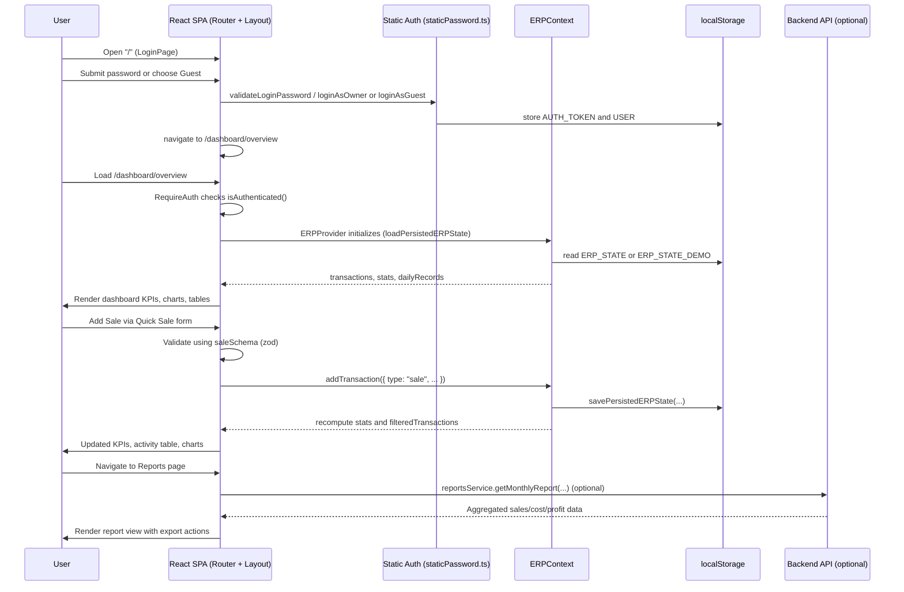

# Cafe ERP Dashboard – Project Documentation

> Single-page React + TypeScript frontend for a cafe ERP-style dashboard (transactions, costs, funds, and reporting).

## Table of Contents

- [Project Overview](#project-overview)
- [Features](#features)
- [Technology Stack](#technology-stack)
- [System Workflow](#system-workflow)
  - [High-Level Flow](#high-level-flow)
  - [Sequence Diagram](#sequence-diagram)
- [API Endpoints](#api-endpoints)
  - [Authentication](#authentication)
  - [Sales](#sales)
  - [Expenses](#expenses)
  - [Fund Management](#fund-management)
  - [Reports](#reports)
- [Database Schema Overview](#database-schema-overview)
- [Test Cases](#test-cases)
  - [Authentication & Navigation](#authentication--navigation)
  - [Dashboard & ERP State](#dashboard--erp-state)
  - [Expenses & Costs](#expenses--costs)
  - [Fund Management](#fund-management-tests)
  - [Reports & Exports](#reports--exports)
  - [Error Handling & Resilience](#error-handling--resilience)
  - [API & Integration](#api--integration)
- [Setup & Installation Guide](#setup--installation-guide)
- [Environment Variables](#environment-variables)
- [Deployment Instructions](#deployment-instructions)

---

## Project Overview

This project is the **frontend for a cafe ERP-style dashboard**. It focuses on day-to-day operational visibility for a cafe, providing:

- Centralized view of sales, costs, and funds.
- Daily records and history with filters and pagination.
- Simple fund movement tracking (cash, bank, bKash).
- Reporting and export tools for management.

It is implemented as a **single-page React application** (SPA) with:

- **Local-first state** stored in `ERPContext` and persisted to `localStorage`.
- Optional integration with a **REST backend API** via a typed service layer.
- Auth flows for **owner** and **guest/demo** usage.

The app is intended for small cafes that need lightweight ERP-like functionality without complex setup.

---

## Features

Core features (from code and existing docs):

- **Authentication**
  - Owner login using a static password (for offline/demo use).
  - Guest mode that instantly logs in with demo data.
  - Auth state and user profile stored in `localStorage`.

- **Dashboard**
  - High-level KPIs: total sales, costs, liquidity, fund balances, profit metrics.
  - Channel breakdown (in-store, Foodpanda, Foodi).
  - Payment method breakdown (cash, bank, bKash).
  - Comparison chart: last 7 days vs prior 7 days (real data from transactions).
  - Quick Sale form with validation (react-hook-form + zod).
  - Recent Activity table using an enhanced table component.

- **Transactions & Daily Record**
  - `ERPContext` holds a list of `Transaction` objects with rich metadata.
  - Daily Record page shows filtered/paginated transactions.
  - Powerful date range filtering (today, week, month, previous month, custom, all).

- **Expenses & Costs**
  - Daily operational expenses tracking.
  - Product (variable) costs: ingredients, packaging, etc.
  - Fixed costs: rent, salary, utilities, maintenance, etc.
  - Category-level summaries and statistics.

- **Fund Management**
  - Track fund movements: `fund_in`, `fund_out`, `cash_to_fund`, `cash_added`, `fund_to_cash`.
  - External vs internal fund breakdowns (cash/bank/bKash).
  - Calculated fund balances and flows in dashboard and reports.

- **Reports & Exports**
  - Daily, monthly, and P&L-style reports (via service layer).
  - Export utilities (Excel, PDF) powered by shared export helpers.
  - Reusable export helpers for transactions, reports, and tables.

- **Global UI Systems**
  - Shared layout (Header, Sidebar, DashboardLayout) with responsive design.
  - Reusable form controls, buttons, cards, charts, tables, modals, pagination, and toasts.
  - ErrorBoundary for component-level crash protection.
  - Centralized error handler utility for async/event/API errors.
  - Manager password flows and protected modals for sensitive actions.

- **Demo Mode & Persistence**
  - Demo mode for guest users that swaps in seeded demo data.
  - Separation of demo vs real ERP data in `localStorage`.
  - Persistent lists (items, suppliers) that survive reloads and user sessions.

---

## Technology Stack

- **Frontend Framework**: React + TypeScript + Vite
- **Styling**: Tailwind CSS
- **Routing**: React Router (nested routes under `/dashboard`)
- **Forms & Validation**: `react-hook-form`, `@hookform/resolvers`, `zod`
- **Charts**: Recharts (e.g., comparison charts on Dashboard)
- **Tables**: TanStack React Table (via `createColumnHelper`)
- **HTTP Client**: Axios (wrapped by `src/services/api.ts` and domain services)
- **State Management**: React Context (`ERPContext`) + local component state + custom hooks
- **Notifications**: Sonner toast library
- **Icons**: lucide-react
- **Build Tooling**: Vite, TypeScript, ESLint

---

## System Workflow

### High-Level Flow

1. **Authentication / Entry**
   - User visits `/` and sees the Login page.
   - Owner logs in using a static password; guest users can enter demo mode.
   - On successful login, a user object and `authToken` are stored in `localStorage`.
   - The app navigates to `/dashboard/overview`.

2. **Protected Area & Layout**
   - `App.tsx` wraps the app in:
     - `ErrorBoundary` for crash protection.
     - `ToastProvider` for global toasts.
     - `Routes` configured with React Router.
   - The `/dashboard/*` route is protected by a `RequireAuth` component, which checks `isAuthenticated()`.
   - Inside the dashboard, `ERPProvider` is mounted and `DashboardLayout` renders `Header`, `Sidebar`, and nested page routes via `<Outlet />`.

3. **ERP State & Local Persistence**
   - `ERPContext` is responsible for:
     - Loading initial ERP state from `localStorage` (demo vs real keys).
     - Managing `transactions`, dynamic lists (`itemNames`, `suppliers`), and date range filters.
     - Computing `filteredTransactions`, `ERPStats`, and `DailyRecord` summaries.
   - Each mutation (e.g., `addTransaction`, `updateTransaction`) updates state and triggers a save to the appropriate local storage key.

4. **User Interactions**
   - Pages use `useERP()` to read transactions, stats, and helper actions.
   - Forms are built with `react-hook-form` and validated by zod schemas (`saleSchema`, `productCostSchema`, etc.).
   - UI components and hooks (`useApi`, `useMutation`, `usePaginatedApi`) hide low-level implementation details.

5. **Backend Integration (Optional)**
   - When a backend exists, domain services (auth, sales, expenses, funds, reports) call REST endpoints under `VITE_API_URL` using `api` from `src/services/api.ts`.
   - Axios interceptors attach the `authToken` header and handle 401 responses by clearing the token and redirecting to `/`.

6. **Error Handling**
   - React render errors are caught by `ErrorBoundary` and replaced with a friendly fallback screen.
   - Async/event/API errors should be wrapped in `try/catch` blocks and reported via `handleError()` from `src/shared/utils/errorHandler.ts`, which logs, toasts, and (optionally) persists error metadata.

### Sequence Diagram



---

## API Endpoints

> Note: This repository is **frontend-only**. The endpoints below describe the expected backend API that the frontend service layer calls. Paths are relative to `VITE_API_URL`.

### Authentication

| Method | Path           | Description                | Request Body          | Response                                     |
| ------ | -------------- | -------------------------- | --------------------- | -------------------------------------------- |
| POST   | `/auth/login`  | Log in with email/password | `{ email, password }` | `{ token, user: { id, email, name, role } }` |
| GET    | `/auth/verify` | Verify current auth token  | –                     | 200 OK if valid; error if not                |

### Sales

| Method | Path            | Description                | Query Params                      | Request Body              | Response        |
| ------ | --------------- | -------------------------- | --------------------------------- | ------------------------- | --------------- |
| GET    | `/sales`        | List sales transactions    | `startDate`, `endDate`, `channel` | –                         | `Transaction[]` |
| GET    | `/sales/:id`    | Get a single sale by ID    | –                                 | –                         | `Transaction`   |
| POST   | `/sales`        | Create a new sale          | –                                 | `SaleCreateData`          | `Transaction`   |
| PUT    | `/sales/:id`    | Update a sale              | –                                 | `Partial<SaleCreateData>` | `Transaction`   |
| DELETE | `/sales/:id`    | Delete a sale              | –                                 | –                         | `void`          |
| GET    | `/sales/stats`  | Get aggregated sales stats | `startDate`, `endDate`            | –                         | `SalesStats`    |
| GET    | `/sales/recent` | Get recent sales           | `limit`                           | –                         | `Transaction[]` |

### Expenses

| Method | Path                      | Description                     | Query Params                               | Request Body                 | Response        |
| ------ | ------------------------- | ------------------------------- | ------------------------------------------ | ---------------------------- | --------------- |
| GET    | `/expenses`               | List all expenses               | `startDate`, `endDate`, `type`, `category` | –                            | `Transaction[]` |
| GET    | `/expenses/:id`           | Get expense by ID               | –                                          | –                            | `Transaction`   |
| POST   | `/expenses`               | Create a new expense            | –                                          | `ExpenseCreateData`          | `Transaction`   |
| PUT    | `/expenses/:id`           | Update an expense               | –                                          | `Partial<ExpenseCreateData>` | `Transaction`   |
| DELETE | `/expenses/:id`           | Delete an expense               | –                                          | –                            | `void`          |
| GET    | `/expenses/stats`         | Get expense summary stats       | `startDate`, `endDate`                     | –                            | `ExpenseStats`  |
| GET    | `/expenses/product-costs` | Get only product/variable costs | `startDate`, `endDate`                     | –                            | `Transaction[]` |
| GET    | `/expenses/fixed-costs`   | Get only fixed costs            | `startDate`, `endDate`                     | –                            | `Transaction[]` |

### Fund Management

| Method | Path             | Description                         | Query Params                   | Request Body                 | Response        |
| ------ | ---------------- | ----------------------------------- | ------------------------------ | ---------------------------- | --------------- |
| GET    | `/funds`         | List all fund-related transactions  | `startDate`, `endDate`, `type` | –                            | `Transaction[]` |
| GET    | `/funds/:id`     | Get a single fund transaction by ID | –                              | –                            | `Transaction`   |
| POST   | `/funds`         | Create a fund operation             | –                              | `FundOperationData`          | `Transaction`   |
| PUT    | `/funds/:id`     | Update a fund operation             | –                              | `Partial<FundOperationData>` | `Transaction`   |
| DELETE | `/funds/:id`     | Delete a fund operation             | –                              | –                            | `void`          |
| GET    | `/funds/stats`   | Get aggregated fund statistics      | `startDate`, `endDate`         | –                            | `FundStats`     |
| GET    | `/funds/balance` | Get current overall fund balance    | –                              | –                            | `number`        |

### Reports

| Method | Path                   | Description                          | Query Params                             | Request Body | Response                 |
| ------ | ---------------------- | ------------------------------------ | ---------------------------------------- | ------------ | ------------------------ |
| GET    | `/reports/daily`       | Get daily report for a specific date | `date`                                   | –            | `DailyReport`            |
| GET    | `/reports/monthly`     | Get monthly report                   | `month` (e.g. `2025-01`)                 | –            | `MonthlyReport`          |
| GET    | `/reports/profit-loss` | Get profit & loss report             | `startDate`, `endDate`                   | –            | `ProfitLossReport`       |
| GET    | `/reports/custom`      | Get custom date range report         | `startDate`, `endDate`                   | –            | `unknown` (custom shape) |
| GET    | `/reports/export`      | Export report as PDF/Excel           | `type`, `format`, `startDate`, `endDate` | –            | `Blob` (binary file)     |

---

## Database Schema Overview

> The repo does **not** include backend or database code. This section describes the **conceptual data model** inferred from TypeScript types and services. Actual table/collection design on the backend may vary.

### Core Entities

- **Transaction**
  - Represents both income and outgoings, including sales, expenses, and fund movements.
  - Key fields:
    - `id: string`
    - `type: "sale" | "sale_adjustment" | "expense_product" | "expense_fixed" | "fund_in" | "fund_out" | "cash_to_fund" | "cash_added" | "fund_to_cash"`
    - `amount: number`
    - `method: "cash" | "bank" | "bkash"`
    - `channel?: "in_store" | "foodpanda" | "foodi"`
    - `description: string`
    - `quantity?: number`
    - `unit?: "kg" | "g" | "L" | "ml" | "pcs" | "box" | "pack"`
    - `unitPrice?: number`
    - `supplier?: string`
    - `date: Date`

- **ERPStats / Derived Aggregates**
  - Calculated from transactions and exposed via `ERPContext`.
  - Includes:
    - Total sales, product costs, fixed costs.
    - Liquidity per payment method and in total.
    - External fund balances and fund flows.
    - Profit, gross profit, expense categories, product usage, top products/fixed costs.

- **DailyRecord**
  - Per-day aggregates of sales, costs, fund movements.
  - Used in the Daily Record and reporting views.

- **User (Frontend Auth)**
  - Static/local auth user shape:
    - `id: string`
    - `name: string`
    - `role: "owner" | "guest"`

- **Report Models**
  - **DailyReport**: per-day revenue, expenses, profit, and breakdowns.
  - **MonthlyReport**: month-level revenue, expenses, profit margin, sales by channel, top expenses.
  - **ProfitLossReport**: period-level P&L summary.

### Recommended Backend Tables (Conceptual)

For a relational backend, typical tables could include:

- `users` (id, name, email, role, hashed_password, created_at, ...)
- `transactions` (id, type, amount, method, channel, description, quantity, unit, unit_price, supplier_id, occurred_at, created_at)
- `suppliers` (id, name, contact, ...)
- `expense_categories` (id, name, type: product/fixed)
- `fund_operations` (might reuse `transactions` with fund-specific attributes, or separate table)
- `reports_cache` (optional materialized snapshots for performance)

The frontend expects **aggregated endpoints**, so the backend should expose views or computed queries to match the `*Stats` and report DTOs.

---

## Test Cases

The following tables describe recommended test cases covering major functionality. They are organized by area and include positive and negative scenarios.

### Authentication & Navigation

| ID       | Description                                | Preconditions                  | Steps                                                          | Expected Result                                                                                 | Test Type |
| -------- | ------------------------------------------ | ------------------------------ | -------------------------------------------------------------- | ----------------------------------------------------------------------------------------------- | --------- |
| AUTH-001 | Owner login succeeds with correct password | App running; no user logged in | 1. Open `/` 2. Enter valid owner password 3. Click **Sign In** | User is redirected to `/dashboard/overview`; `authToken` and `user` saved to localStorage       | E2E       |
| AUTH-002 | Owner login fails with wrong password      | App running                    | 1. Open `/` 2. Enter invalid password 3. Click **Sign In**     | Error toast "Wrong password" shown; user stays on Login page; no auth token stored              | E2E       |
| AUTH-003 | Guest mode login                           | App running                    | 1. Open `/` 2. Click **Guest Mode**                            | User is redirected to dashboard; `user.role === "guest"` in storage; demo ERP data loaded       | E2E       |
| AUTH-004 | Protected route redirects when not authed  | No `authToken` in localStorage | 1. Open `/dashboard/overview` directly in browser              | App redirects to `/` (login); no dashboard content rendered                                     | E2E       |
| AUTH-005 | Auth persistence after reload              | User already logged in         | 1. Navigate to `/dashboard/overview` 2. Reload page            | Still on `/dashboard/overview`; `RequireAuth` passes because `isAuthenticated()` returns `true` | E2E       |

### Dashboard & ERP State

| ID       | Description                                  | Preconditions                      | Steps                                                                                 | Expected Result                                                                              | Test Type   |
| -------- | -------------------------------------------- | ---------------------------------- | ------------------------------------------------------------------------------------- | -------------------------------------------------------------------------------------------- | ----------- |
| DASH-001 | Add sale via Quick Sale form                 | Logged in; dashboard loaded        | 1. Enter valid amount, channel, method 2. Optional description 3. Submit form         | New `sale` transaction added; KPIs and recent activity table update; success toast appears   | Integration |
| DASH-002 | Quick Sale validation on empty amount        | Logged in; dashboard loaded        | 1. Leave amount blank 2. Submit form                                                  | Validation error message under amount; transaction not added; no change to stats             | Unit/Int    |
| DASH-003 | Date range filter updates stats and table    | Several transactions exist         | 1. Change date range to `week` 2. Observe KPIs and table                              | `filteredTransactions` only include last 7 days; KPIs and table rows match selected range    | Integration |
| DASH-004 | Demo mode switches dataset                   | Guest user logged in               | 1. Trigger demo mode toggle (where exposed)                                           | ERP data instantly swapped to demo dataset; stats and lists reflect demo data                | Integration |
| DASH-005 | Daily available cash calculation correctness | Known test dataset in localStorage | 1. Load dashboard 2. Compare displayed "Today’s Available Liquidity" with manual calc | Displayed value equals sum of sale-like inflows minus expense and transfer outflows in range | Unit        |

### Expenses & Costs

| ID      | Description                       | Preconditions                      | Steps                                                        | Expected Result                                                                     | Test Type   |
| ------- | --------------------------------- | ---------------------------------- | ------------------------------------------------------------ | ----------------------------------------------------------------------------------- | ----------- |
| EXP-001 | Create product expense            | Logged in; Product Costs page open | 1. Fill all required fields with valid values 2. Submit form | New `expense_product` transaction stored; product cost totals and categories update | Integration |
| EXP-002 | Product expense validation errors | Logged in; Product Costs page open | 1. Leave `item` empty 2. Submit form                         | Validation shows "Item name is required"; transaction not added                     | Unit/Int    |
| EXP-003 | Create fixed cost                 | Logged in; Fixed Costs page open   | 1. Enter description, amount, method 2. Submit               | New `expense_fixed` transaction recorded; fixed cost totals updated                 | Integration |
| EXP-004 | Filter expenses by category       | Logged in; backend connected       | 1. Apply category filter via UI (if present)                 | Only expenses matching selected category are displayed; totals recalc               | Integration |

### Fund Management Tests

| ID       | Description                              | Preconditions                        | Steps                                       | Expected Result                                                                             | Test Type   |
| -------- | ---------------------------------------- | ------------------------------------ | ------------------------------------------- | ------------------------------------------------------------------------------------------- | ----------- |
| FUND-001 | Record `fund_in` operation               | Logged in; Fund Management page open | 1. Enter valid `fund_in` operation via form | New `fund_in` transaction created; fund balance and external fund breakdown updated         | Integration |
| FUND-002 | Record `cash_to_fund` transfer           | Logged in; Fund Management page open | 1. Enter cash-to-fund transfer 2. Submit    | Cash balance decreases; fund balance increases; fund flow metrics update correctly          | Integration |
| FUND-003 | Fund stats match underlying transactions | Known dataset available              | 1. Load fund stats view/report              | Fund totals, withdrawals, and external additions match sums derived from `Transaction` list | Unit        |

### Reports & Exports

| ID      | Description                    | Preconditions                  | Steps                                            | Expected Result                                                                                   | Test Type   |
| ------- | ------------------------------ | ------------------------------ | ------------------------------------------------ | ------------------------------------------------------------------------------------------------- | ----------- |
| REP-001 | Daily report API integration   | Backend up; sample data seeded | 1. Navigate to reports 2. Select a specific date | Frontend calls `/reports/daily` with `date`; UI displays total sales, expenses, profit, breakdown | Integration |
| REP-002 | Monthly report API integration | Backend up; sample data seeded | 1. Select a month in reports UI                  | Frontend calls `/reports/monthly` and renders returned aggregates and top expenses                | Integration |
| REP-003 | Profit & loss report           | Backend up; sample data seeded | 1. Select start and end dates for P&L            | P&L view shows revenue, totalExpenses, grossProfit, profit margin, and breakdowns from API        | Integration |
| REP-004 | Export report as PDF           | Backend supports export        | 1. Choose a report 2. Click **Export as PDF**    | Frontend calls `/reports/export` with appropriate params; browser downloads PDF file              | E2E         |

### Error Handling & Resilience

| ID      | Description                                  | Preconditions                       | Steps                                                                      | Expected Result                                                                                       | Test Type   |
| ------- | -------------------------------------------- | ----------------------------------- | -------------------------------------------------------------------------- | ----------------------------------------------------------------------------------------------------- | ----------- |
| ERR-001 | ErrorBoundary catches render error           | App running                         | 1. Temporarily throw in a component render (per TESTING_ERROR_BOUNDARY.md) | Global ErrorBoundary renders fallback UI; original component tree unmounted safely                    | Integration |
| ERR-002 | Error handler logs API failure               | Backend returns 500 for an endpoint | 1. Trigger a failing API call wrapped in `withErrorHandling`               | `handleError` called with context; user sees friendly toast; error metadata stored (e.g., in storage) | Unit/Int    |
| ERR-003 | Unauthorized API triggers logout             | Expired/invalid token in storage    | 1. Hit any protected endpoint 2. Backend returns 401                       | Axios interceptor clears `authToken` and redirects to `/`; user must log in again                     | Integration |
| ERR-004 | LocalStorage failures are handled gracefully | Simulate `localStorage` throwing    | 1. Force storage quota or disable storage in tests                         | Catch blocks prevent app from crashing; errors logged/handled; app still renders fallbacks            | Unit        |

### API & Integration

| ID      | Description                              | Preconditions                       | Steps                                                                          | Expected Result                                                                        | Test Type |
| ------- | ---------------------------------------- | ----------------------------------- | ------------------------------------------------------------------------------ | -------------------------------------------------------------------------------------- | --------- |
| API-001 | `useApi` hook handles success            | Backend up; endpoint available      | 1. Use `useApi(() => salesService.getAll())` in a test component               | `data` populated, `loading` false, `error` null after fetch                            | Unit      |
| API-002 | `useApi` hook handles error              | Endpoint returns error              | 1. Point `useApi` to failing endpoint                                          | `error` contains message; `loading` false; console logs include error                  | Unit      |
| API-003 | `useMutation` returns data on success    | Backend up; create endpoint working | 1. Call `mutate` with valid payload                                            | Returned data matches API response; `data` state updated; `loading` toggles correctly  | Unit      |
| API-004 | `usePaginatedApi` updates on page change | Backend provides paginated response | 1. Use `usePaginatedApi` in a component 2. Change page via `pagination.next()` | Hook refetches with new page; `data` and pagination totals reflect new server response | Unit/Int  |

---

## Setup & Installation Guide

Basic setup is already documented in `docs/SETUP.md`; summarized here for convenience.

1. **Prerequisites**
   - Node.js (LTS recommended)
   - npm

2. **Install dependencies**

   ```bash
   npm install
   ```

3. **Run development server**

   ```bash
   npm run dev
   ```

   Vite will print the local dev URL (typically `http://localhost:5173`).

4. **Build for production**

   ```bash
   npm run build
   ```

   This outputs a static bundle to the `dist/` directory.

5. **Preview production build locally**

   ```bash
   npm run preview
   ```

   This serves the `dist/` output locally for final verification.

---

## Environment Variables

The frontend supports configuration via Vite environment variables.

- `VITE_API_URL`
  - **Purpose**: Base URL for the backend API.
  - **Default**: `http://localhost:3000/api` (from both `API_CONFIG.BASE_URL` and `services/api.ts`).
  - **Usage**: Controls Axios `baseURL` and is used wherever API calls are made.

Example `.env` file at project root:

```env
VITE_API_URL=https://api.mycafeerp.com/api
```

> Note: Restart the dev server after changing `.env` values.

---

## Deployment Instructions

Because this is a Vite-powered SPA, deployment is a matter of **building static assets** and serving them via any static hosting platform or web server.

### 1. Build the App

```bash
npm install
npm run build
```

This generates the production-ready bundle in `dist/`.

### 2. Static Hosting Options

- **Netlify / Vercel / Render / GitHub Pages**
  - Point the platform to the repo.
  - Configure the build command as `npm run build` and output directory as `dist`.
  - For client-side routing, ensure a fallback to `index.html` for unknown paths (e.g., Netlify `_redirects` or Vercel `rewrites`).

- **Nginx or Apache**
  - Copy contents of `dist/` to your server's web root.
  - Configure a **single-page app fallback** so that `/dashboard/*` routes are served `index.html`.

Example Nginx location block:

```nginx
location / {
  try_files $uri /index.html;
}
```

### 3. Backend Alignment

If using the optional backend API:

- Deploy the API behind a stable base URL, e.g. `https://api.mycafeerp.com/api`.
- Set `VITE_API_URL` accordingly at build time (via environment in CI/CD or hosting provider).
- Ensure CORS is configured to allow the frontend origin if they are on different domains.

### 4. Recommended CI/CD Flow

- On each push to `main`:
  1. Install dependencies (`npm ci`).
  2. Run lint/tests (once test suite exists).
  3. Run `npm run build`.
  4. Deploy contents of `dist/` to your hosting target.

With these steps, the Cafe ERP Dashboard frontend is ready for production deployment while remaining configurable via `VITE_API_URL`.
